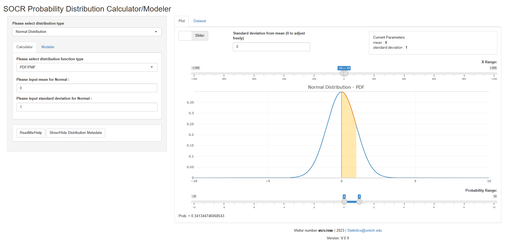
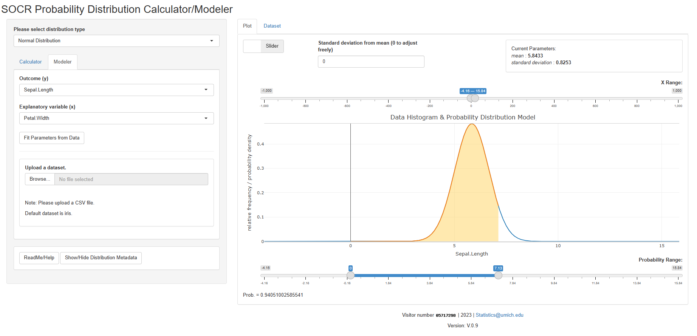

# RShiny Probability Distribution Calculator/Modeler

## Overview 
The [SOCR RShiny probability distribution calculators](LINK_NEEDED) provide interactive vizualizations of probability densities, mass functions, and cumulative distributions, e.g., [bivariate normal distribution](https://socr.umich.edu/HTML5/BivariateNormal/).

The most current version is V0.9, deployed at [here](LINK_NEEDED). The release can be find [here](https://github.com/SOCR/ProbDistCalc_RShiny/releases/tag/Ver0.9).

## Team

[SOCR Team](http://www.socr.umich.edu/people/) including [Ivo D. Dinov](http://umich.edu/~dinov), Jared Chai, and others.

## Code Structure

The code is organized as follows:
- `ui.R` and `server.R` are the main files for the RShiny app.
- `global.R` contains the global variables and functions.
- `dataset.R` contains the initialization and pre-processing of the dataset.
- `fitFunctions.R` contains the functions for fitting the distribution in modeler.
- `distributionInfo.R` contains the functions for getting the distribution information. The information is stored in `distribution_info.yaml`.
- `plotlyFunctions/*.R` contain the functions for plotting distributions.
- `renderMainPlot.R` contains the functions for rendering the main plot.
- `renderProbabilitt.R` contains the functions for rendering the probabilities calculated.

Other files are mostly for testing and debugging and less important.

## Guidelines for Future Development
- Using RStudio is the easiest way to develop and the app almost out-of-box. However, if you want to use other IDEs like VSCode, use `renv` to manage the packages. The `renv.lock` file is already included in the repo. To install the packages, run `renv::restore()` in the R console.

- To support a new distribution: 
    - Add the distribution information in `distribution_info.yaml`. Note that the `fitFunc` field indicates the function for fitting the distribution in modeler, and the `plotlyFunc` field indicates the function for plotting the distribution in calculator.
    - This distribution will be read by functions in `distributionInfo.R` into a list of type `distributionInfoClass`.
    - Then the corresponding distributionInfo object will be included in the `distributionInfoList` in `global.R`.
    - Add corresponding functions in `plotlyFunctions/*.R` for plotting the distribution in calculator, and add functions in `fitFunctions.R` for fitting the distribution in modeler.
- To support more existing distributions in modeler:
    - Implement the corresponding fitting function in `fitFunctions.R`.
    - That's it! The distribution will be automatically supported by the modeler.

## Acknowledgments

This work is supported in part by NIH grants [P20 NR015331](www.socr.umich.edu/CSCD), [UL1TR002240](https://projectreporter.nih.gov/project_info_description.cfm?aid=9491961&icde=39078316), [P30 DK089503](http://mmoc.med.umich.edu/), [UL1TR002240](https://www.michr.umich.edu), and NSF grants [1916425](http://midas.umich.edu/), [1734853](http://brain-life.org/), [1636840](http://neurosciencenetwork.org/), [1416953](http://distributome.org), [0716055](http://socr.umich.edu) and [1023115](http://distributome.org). Students, trainees, scholars, and researchers from SOCR, BDDS, MIDAS, MICHR, and the broad R-statistical computing community have contributed ideas, code, and support.

## References

* [Probability Distributome Calculators](http://www.distributome.org/V3/calc/index.html), the [Distributome Navigator](http://distributome.org/V3/), [XML distribution metadata](http://www.distributome.org/js/Distributome.xml), and [XML DB validator](http://www.distributome.org/V3/Distributome.xml.html).
* [Deployed RShiny Webapp](https://shiny.med.umich.edu/apps/dinov/SOCR_DistribCalc_RShiny_App/).
* [Bivariate Normal Distribution Calculator](https://github.com/SOCR/SOCR_Bivariate_Distributions) and the [SOCR Bivariate Normal Distribution Activity](http://wiki.stat.ucla.edu/socr/index.php/SOCR_BivariateNormal_JS_Activity).
* [SOCR Distributions](http://www.socr.ucla.edu/htmls/dist/) and [distribution activities](http://wiki.socr.umich.edu/index.php/SOCR_EduMaterials_DistributionsActivities).

## TODO
- [ ]  There should be histogram indicating the original dataset along with the distribution curve plot. Part of the code is already in the branch `sub`, but it only works for the normal distribution. Need to generalize it.
- [ ] To generalize the histogram, we may need to extract the similar code in plotlyFunctions into a separate function. Otherwise we have to repeat the code for histogram 70+ times for each distribution. Currently the code is mostly duplicated but slightly different in these functions, which makes it very hard to extract the common code.
- [ ]  Deploy to SOCR server. Update the `LINK_NEEDED` in this README.
- [ ]  Support more existing distributions in modeler. Currently only very few distributions are supported in modeler. To do this, follow the guidelines in the section above.